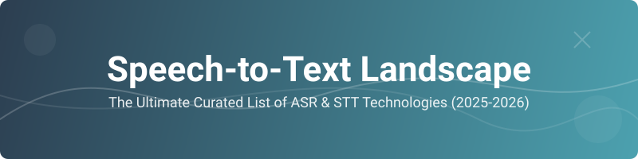

  

<h1 align="center">🎙️ Speech-to-Text Landscape (ASR/STT) 🚀</h1>

  
  
  
  
  

  <b>A comprehensive, curated collection of the best Speech-to-Text (STT) and Automatic Speech Recognition (ASR) technologies, including state-of-the-art open-source models, commercial SaaS APIs, and cutting-edge research.</b>

## 📖 Table of Contents
- [🚀 State-of-the-Art Open Source Models](#-state-of-the-art-open-source-models-2025-2026)
- [🏢 Commercial Speech-to-Text Services (SaaS)](#-commercial-speech-to-text-services-saas)
- [🛠️ Modern Tools & Community Recommendations](#️-modern-tools--community-recommendations)
- [📄 Recent Research Papers](#-recent-research-papers-2025-2026)
- [🏛️ Legacy & Historical Projects](#️-legacy--historical-projects)
- [📢 Community Resources](#-community-resources)
- [🤝 Contributing](#-contributing)

## 🚀 State-of-the-Art Open Source Models (2025-2026)

The open-source community has revolutionized ASR, making high-accuracy transcription accessible to everyone. 🌟

| Model | Developer | Key Features | Code / Paper |
| :--- | :--- | :--- | :--- |
| **Whisper (V3/V4)** | OpenAI | 🌍 Multilingual (99+ languages), industry standard accuracy. | [GitHub](https://github.com/openai/whisper) |
| **Canary** | NVIDIA | 🏆 Top-tier WER performance, optimized for English & Spanish. | [NeMo](https://github.com/NVIDIA/NeMo) |
| **Faster-Whisper** | SYSTRAN | ⚡ 4x faster Whisper implementation using CTranslate2. | [GitHub](https://github.com/SYSTRAN/faster-whisper) |
| **Distil-Whisper** | Hugging Face | 📉 6x faster, 50% smaller than Whisper Large V3. | [GitHub](https://github.com/huggingface/distil-whisper) |
| **Moonshine** | Useful Sensors | 📱 Optimized for edge and mobile devices with tiny footprint. | [GitHub](https://github.com/usefulsensors/moonshine) |
| **Vosk** | Alpha Cephei | ☁️ Portable, offline, lightweight (Android/iOS/RPi). | [GitHub](https://github.com/alphacep/vosk-api) |

---

## 🏢 Commercial Speech-to-Text Services (SaaS)

For enterprise-grade reliability, ultra-low latency, and advanced audio intelligence. 💎

| Service | Pricing (Standard/Batch) | Free Tier / Trial Limits | Key Features |
| :--- | :--- | :--- | :--- |
| **Deepgram** | $0.0077/min (PAYG) | 🎁 $200 one-time credit | Nova-3 model; <300ms latency; unified STT/TTS. |
| **AssemblyAI** | $0.15/hr ($0.0025/min) | 🎁 $50 one-time credit | Universal-3 Pro; LLM integration (LeMUR). |
| **OpenAI (API)** | $0.006/min | 💳 Pay-as-you-go | Whisper V3/V4; GPT-4o-audio integration. |
| **Gladia** | $0.61/hr (Async) | 🎁 10 hours/month | Multi-model engine; Diarization/Sentiment included. |
| **Speechmatics** | $0.24/hr (Pro) | 🎁 8 hours/month | High accuracy on accents; "Flow" voice agent. |
| **Google Cloud** | $0.016/min | 🎁 60 minutes/month | Chirp model; GCP ecosystem integration. |
| **AWS Transcribe** | $0.024/min | 🎁 60 mins/mo (12 mo) | Call analytics; PII redaction. |
| **Azure Speech** | $0.0167/min | 🎁 5 hours/month | Microsoft 365/Teams integration. |

---

## 🛠️ Modern Tools & Community Recommendations

Ready-to-use applications for dictation, meetings, and productivity. 🛠️

| Product | Best For | Pricing (Approx.) | Link |
| :--- | :--- | :--- | :--- |
| **Wispr Flow** | ✍️ Polished dictation & writing | $15/mo (Free tier avail) | [Link](https://www.flowvoice.ai/) |
| **Superwhisper** | 🔐 Local processing for Mac | One-time / Subscription | [Link](https://superwhisper.com/) |
| **Groq (Whisper)** | ⚡ Ultra-fast LPU inference | Free (Beta/Limits) | [Link](https://groq.com/) |
| **Resonant** | 🏠 Free, local, private (Win/Mac) | Free | [Link](https://resonant.fm/) |
| **Otter.ai** | 👥 Meeting transcription | $10-20/mo | [Link](https://otter.ai/) |

---

## 📄 Recent Research Papers (2025-2026)

Stay on the cutting edge of Automatic Speech Recognition. 📚

| Paper Title | Key Innovation | Link |
| :--- | :--- | :--- |
| **Speech-Hands** | 🧠 Self-reflection agentic decoding for ASR | [arXiv:2601.01234](https://arxiv.org/abs/2601.01234) |
| **M2S-AVSR** | 👁️ Multi-view audio-visual fusion for noise robustness | [arXiv:2606.05440](https://arxiv.org/abs/2606.05440) |
| **SiamCTC** | ⏳ Monotonic temporal alignment for low-latency | [arXiv:2606.02220](https://arxiv.org/abs/2606.02220) |
| **Speaker LLMs** | 👤 Speaker Attributed ASR using Speech Aware LLMs | [arXiv:2604.11269](https://arxiv.org/abs/2604.11269) |

---

## 🏛️ Legacy & Historical Projects

A tribute to the pioneers of speech technology. 🕰️

| Samples | Code Link | Status |
| :--- | :--- | :--- |
| Mozilla DeepSpeech | [DeepSpeech](https://github.com/mozilla/DeepSpeech) | Legacy / Discontinued |
| Wavenet (buriburisuri) | [wavenet](https://github.com/buriburisuri/speech-to-text-wavenet) | Historical |
| Baidu Warp-CTC | [warp-ctc](https://github.com/baidu-research/warp-ctc) | Historical |
| deepeech.torch | [deepspeech.torch](https://github.com/SeanNaren/deepspeech.torch) | Legacy |

---

## 📢 Community Resources

Join the conversation and stay updated. 💬

*   [Reddit: r/speechtech](https://www.reddit.com/r/speechtech/) - Technical discussions on ASR.
*   [Reddit: r/LocalLLaMA](https://www.reddit.com/r/LocalLLaMA/) - Great for self-hosted STT discussions.
*   [Open ASR Leaderboard](https://huggingface.co/spaces/hf-audio/open_asr_leaderboard) - Real-time model benchmarks.

---

## 🤝 Contributing

We ❤️ contributions! If you have a new model, service, or paper to add, please feel free to open a Pull Request.

1. Fork the repo.
2. Add your entry to the relevant section.
3. Submit a PR!

---

### Support:

If you want the good work to continue please support us on

*   [PAYPAL](https://www.paypal.me/ishandutta2007)
*   [BITCOIN ADDRESS: 3LZazKXG18Hxa3LLNAeKYZNtLzCxpv1LyD](https://www.coinbase.com/join/5a8e4a045b02c403bc3a9c0c)
